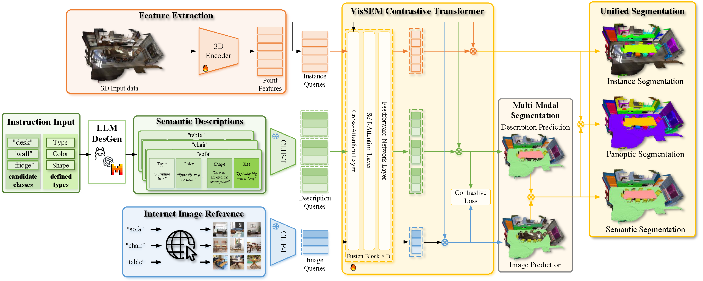
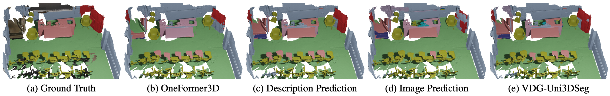

<div align="center">
<h1> ✨ VDG-Uni3DSeg </h1>
<h2>All in One: Visual-Description-Guided Unified Point Cloud Segmentation</h2>


[Zongyan Han](https://github.com/Hanzy1996)<sup>1</sup>,[Mohamed El Amine Boudjoghra](https://aminebdj.github.io)<sup>2</sup>,[Jiahua Dong](https://scholar.google.com/citations?user=xrXqa8AAAAAJ&hl=zh-CN)<sup>1</sup>, [Jinhong Wang](https://github.com/TommyIX)<sup>1</sup>, [Rao Muhammad Anwer](https://scholar.google.fi/citations?user=_KlvMVoAAAAJ&hl=en)<sup>1</sup>,

<sup>1</sup> Mohamed Bin Zayed University of Artificial Intelligence (MBZUAI), <sup>2</sup> Technical University of Munich

📄 [[`Paper`](https://arxiv.org/pdf/2507.05211)] 
</div>

## 💡 Introduction
Unified segmentation of 3D point clouds is crucial for scene understanding, but is hindered by its sparse structure, limited annotations, and the challenge of distinguishing fine-grained object classes in complex environments. Existing methods often struggle to capture rich semantic and contextual information due to limited supervision and a lack of diverse multimodal cues, leading to suboptimal differentiation of classes and instances.
To address these challenges, we propose VDG-Uni3DSeg, a novel framework that integrates pre-trained vision-language models (e.g., CLIP) and large language models (LLMs) to enhance 3D segmentation. By leveraging LLM-generated textual descriptions and reference images from the internet, our method incorporates rich multimodal cues, facilitating fine-grained class and instance separation.
We further design a Semantic-Visual Contrastive Loss to align point features with multimodal queries and a Spatial Enhanced Module to model scene-wide relationships efficiently. Operating within a closed-set paradigm that utilizes multimodal knowledge generated offline, VDG-Uni3DSeg achieves state-of-the-art results in semantic, instance, and panoptic segmentation, offering a scalable and practical solution for 3D understanding.

<p align="center">
  
</p>

## 🚀 Installation & Data Preparation

### 🛠️ 1. Installation & Data Prep
Please refer to the official [Oneformer3D](https://github.com/filaPro/oneformer3d) to set up the environment and prepare the datasets with ease.


### 🌐 2. Internet Images

1. To obtain internet images, we use the [google-images-download](https://github.com/ultralytics/google-images-download) tool. Please follow the instructions below to install it:

```bash
mkdir internet_image && cd internet_image
git clone https://github.com/ultralytics/google-images-download
cd google-images-download
pip install -r requirements.txt
```

2. Once installed, you can download images by running the following command. For example, to download 20 images for the class "sofa" (e.g., for the S3DIS dataset), use:

```shell
python3 bing_scraper.py --search sofa --limit 20 --download --output_directory 'images/s3dis'
```

> **Tip:** We’ve already collected images for you! Find them in `internet_image/images` or grab the zip [here]().

3. Next, extract image features using the CLIP model. Use the commands below to install CLIP and extract features:

```shell
pip install git+https://github.com/openai/CLIP.git
python get_image_features.py
```
> Or download pre-extracted features [here]().


### 📝 3. Generating LLM Descriptions

We follow this [method](https://github.com/sachit-menon/classify_by_description_release), swapping GPT for [Llama3.1-8B-Instruct](https://huggingface.co/meta-llama/Llama-3.1-8B-Instruct) model.

1. **Get the Model:**
   ```bash
   # Download weights & tokenizer from HuggingFace
   # Place them in:
   ./llama_model/Llama3.1-8B-Instruct
   ```
2. **Generate Descriptions:**
   ```bash
   torchrun --nproc_per_node 1 generate_descriptors_llama.py
   ```
   Descriptions 👉 `./class_description/descriptors`

> We’ve pre-generated descriptors for **ScanNet**, **ScanNet200**, and **S3DIS**. Download the bundle [here]().

3. **Extract Text Features:**
   ```bash
   python get_text_features_llama.py
   ```
   CLIP embeddings 👉 `class_description/clip_embedding`

> Pre-extracted text features are also available [here]().


## 🏋️‍♂️ Training and Evaluation

Below we provide training and testing commands for three datasets: **ScanNet**, **ScanNet200**, and **S3DIS**. 

### 📦 ScanNet

- **Backbone**: [SpConv](https://github.com/traveller59/spconv)
- **Init checkpoint**: [SSTNet](https://github.com/Gorilla-Lab-SCUT/SSTNet)  
  📥 [Download](https://github.com/oneformer3d/oneformer3d/releases/download/v1.0/sstnet_scannet.pth) and place in `work_dirs/tmp/`

```bash
# Train
python tools/train.py configs/vdguni_scannet.py

# Fix checkpoint before evaluation
python tools/fix_spconv_checkpoint.py --in-path work_dirs/vdguni_scannet/epoch_512.pth --out-path work_dirs/vdguni_scannet/final.pth

# Evaluation
python tools/test.py configs/vdguni_scannet.py work_dirs/vdguni_scannet/final.pth
```


### 🧱 ScanNet200

- **Backbone**: [MinkowskiEngine](https://github.com/NVIDIA/MinkowskiEngine)
- **Init checkpoint**: [Mask3D](https://github.com/JonasSchult/Mask3D)  
  📥 [Download](https://github.com/oneformer3d/oneformer3d/releases/download/v1.0/mask3d_scannet200.pth) and place in `work_dirs/tmp/`

```shell
# Train
python tools/train.py configs/vdguni_scannet200.py
# Evaluation
python tools/test.py configs/vdguni_scannet200.py work_dirs/vdguni_scannet200/epoch_512.pth
```


### 🏫 S3DIS

- **Backbone**: [SpConv]((https://github.com/traveller59/spconv)
- **Pretrained on**: Structured3D + ScanNet  
  📥 [Download](https://github.com/oneformer3d/oneformer3d/releases/download/v1.0/instance-only-oneformer3d_1xb2_scannet-and-structured3d.pth) and place in `work_dirs/tmp/`

We train on Areas 1–4,6 and test on Area 5. Modify `train_area` / `test_area` in the config to change splits.

```shell
# Train
python tools/train.py configs/vdguni_s3dis.py

# Fix checkpoint before evaluation
python tools/fix_spconv_checkpoint.py --in-path work_dirs/vdguni_s3dis/epoch_512.pth --out-path work_dirs/vdguni_s3dis/final.pth

# Evaluation
python tools/test.py configs/vdguni_s3dis.py work_dirs/vdguni_s3dis/final.pth
```


## 📊 Model Zoo & Results

Note: Due to random initialization, training results may slightly vary. Running multiple seeds may be needed to match paper performance.

| Dataset | mAP<sub>25</sub> | mAP<sub>50</sub> | mAP | mIoU | PQ | Download |
|:-------:|:----------------:|:----------------:|:---:|:----:|:--:|:--------:|
| ScanNet | 86.3 | 78.1 | 59.1 | 76.1 | 71.3 | [model]() &#124; [log]() &#124; [config]() |
| ScanNet200 | 45.1 | 40.0 | 29.5 | 29.7 | 31.3 | [model]() &#124; [log]() &#124; [config]() |
| S3DIS | 80.6 | 74.1 | 60.1 | 71.5 | 66.3 | [model]() &#124; [log]() &#124; [config]() |

### 🖼️ Example Semantic Segmentation

<p align="center">
  
</p>


### Citation

If you find this work useful for your research, please cite our paper:

```
@inproceedings{han2025all,
  title={All in One: Visual-Description-Guided Unified Point Cloud Segmentation},
  author={Han, Zongyan and Boudjoghra, Mohamed El Amine and Dong, Jiahua and Wang, Jinhong and Anwer, Rao Muhammad},
  booktitle={Proceedings of the IEEE/CVF International Conference on Computer Vision},
  year={2025}
}
```
